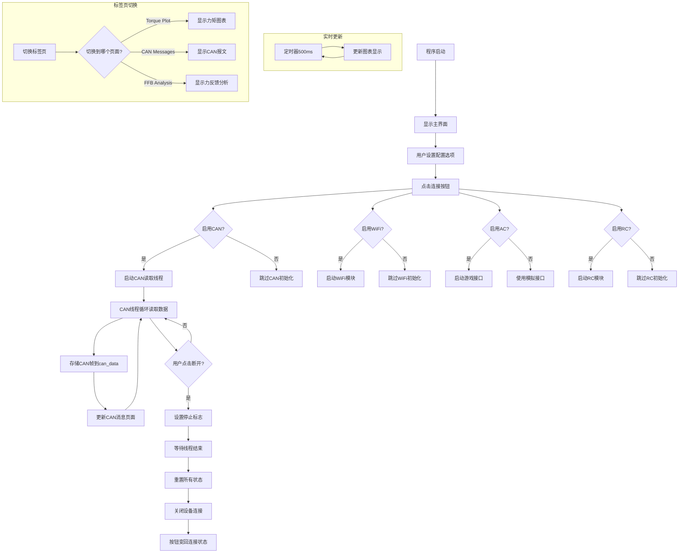

## 当前界面操作逻辑说明

### 1. 界面布局结构
```
主窗口 (RealTimePlotWindow)
├── 控制面板区域
│   ├── WiFi 设置 (ON/OFF)
│   ├── CAN 设置 (ON/OFF)
│   ├── AC 设置 (ON/OFF)
│   ├── RC 设置 (ON/OFF)
│   ├── 通信状态标签
│   └── 连接/断开按钮
├── Tab 控件区域
│   ├── Torque Plot 标签页 (图表显示)
│   ├── CAN Messages 标签页 (CAN报文)
│   └── FFB Analysis 标签页 (力反馈分析)
└── 菜单栏
    └── 设置菜单
        └── 日志配置
```

### 2. 操作流程

#### 启动流程：
1. 程序启动 → 显示主界面
2. 用户设置配置选项 (WiFi/CAN/AC/RC)
3. 点击 "🟢 Connect" 按钮
4. 系统保存配置到本地文件
5. 根据配置启动相应模块：
   - 如果启用 CAN → 启动 CAN 读取线程
   - 如果启用 WiFi → 启动 WiFi 模块
   - 如果启用 AC → 启动游戏接口
   - 如果启用 RC → 启动 RC 模块

#### 运行时流程：
1. CAN 数据读取线程持续运行
2. 读取到 CAN 帧数据 → 存储到 [can_data](file://c:\Users\Administrator\Desktop\g112RC730\gui.py#L0-L0) 列表
3. 同时更新 CAN Messages 页面显示
4. 主线程定时更新图表 (500ms 间隔)
5. 用户可切换不同标签页查看不同信息

#### 断开流程：
1. 点击 "🔴 Disconnect" 按钮
2. 设置停止标志终止所有线程
3. 重置所有状态和数据
4. 关闭 CAN 设备连接
5. 按钮变回 "🟢 Connect" 状态

## 流程图



### 3. 核心功能模块

#### 3.1 连接控制逻辑
```python
# 连接/断开切换
def toggle_connection(self):
    if self.is_connected:  # 当前已连接，执行断开操作
        self.conn_status_label.setText("Communication: ⚪ Disconnected")
        self.toggle_conn_button.setText("🟢 Connect")
        self.reset_all_states()  # 重置所有状态
    else:  # 当前已断开，执行连接操作
        self.conn_status_label.setText("Communication: 🟢 Connected")
        self.toggle_conn_button.setText("🔴 Disconnect")
        self.start_can_reader()  # 启动CAN读取
```

#### 3.2 CAN 数据处理流程
```python
# CAN读取线程
def start_can_reader(self):
    def can_reader():
        while not self.can_reader_stop_flag and self.is_connected:
            # 读取CAN数据
            # 更新can_data列表
            # 调用can_message_page.append_message()更新显示
            time.sleep(0.01)
```

#### 3.3 线程安全的消息显示
```python
# CanMessagePage中的线程安全更新
def append_message(self, message: str):
    self.message_received.emit(message)  # 发射信号
    
def _append_message_thread_safe(self, message: str):
    self.text_edit.append(message)  # 在GUI线程中更新UI
```

### 4. 状态管理

#### 4.1 配置状态
- [USE_WIFI](file://c:\Users\Administrator\Desktop\g112RC730\gui.py#L0-L0): 是否启用WiFi通信
- [USE_REAL_CAN](file://c:\Users\Administrator\Desktop\g112RC730\gui.py#L0-L0): 是否使用真实CAN设备
- [USE_REAL_AC](file://c:\Users\Administrator\Desktop\g112RC730\gui.py#L0-L0): 是否连接真实游戏
- [USE_RC](file://c:\Users\Administrator\Desktop\g112RC730\gui.py#L0-L0): 是否使用RC遥控器

#### 4.2 运行状态
- [is_connected](file://c:\Users\Administrator\Desktop\g112RC730\gui.py#L0-L0): 通信连接状态
- [can_reader_stop_flag](file://c:\Users\Administrator\Desktop\g112RC730\gui.py#L0-L0): CAN读取线程停止标志
- [config_ready_event](file://c:\Users\Administrator\Desktop\g112RC730\gui.py#L0-L0): 配置就绪事件

#### 4.3 数据状态
- [can_data](file://c:\Users\Administrator\Desktop\g112RC730\gui.py#L0-L0): 存储接收到的CAN帧
- [torque_data](file://c:\Users\Administrator\Desktop\g112RC730\gui.py#L0-L0): 存储力矩相关数据
- [is_plot_visible](file://c:\Users\Administrator\Desktop\g112RC730\gui.py#L0-L0): 图表是否可见

这个设计实现了模块化的状态管理，通过事件驱动的方式协调各个组件的工作。

#### 4.4 线程状态
wifi、can\ac\rc模块的启动和停止通过线程实现，通过标志位控制线程的运行和停止。
线程的状态管理通过标志位实现，通过标志位控制线程的运行和停止。
