## 当前界面操作逻辑说明

### 1. 界面布局结构
```
主窗口 (RealTimePlotWindow)
├── 控制面板区域
│   ├── WiFi 设置 (ON/OFF)
│   ├── CAN 设置 (ON/OFF)
│   ├── AC 设置 (ON/OFF)
│   ├── RC 设置 (ON/OFF)
│   ├── 通信状态标签
│   └── 连接/断开按钮
├── Tab 控件区域
│   ├── Torque Plot 标签页 (图表显示)
│   ├── CAN Messages 标签页 (CAN报文)
│   └── FFB Analysis 标签页 (力反馈分析)
└── 菜单栏
    └── 设置菜单
        └── 日志配置
```

### 2. 操作流程

#### 启动流程：
1. 程序启动 → 显示主界面
2. 用户设置配置选项 (WiFi/CAN/AC/RC)
3. 点击 "🟢 Connect" 按钮
4. 系统保存配置到本地文件
5. 根据配置启动相应模块：
   - 如果启用 CAN → 启动 CAN 读取线程
   - 如果启用 WiFi → 启动 WiFi 模块
   - 如果启用 AC → 启动游戏接口
   - 如果启用 RC → 启动 RC 模块

#### 运行时流程：
1. CAN 数据读取线程持续运行
2. 读取到 CAN 帧数据 → 存储到 [can_data](file://c:\Users\Administrator\Desktop\g112RC730\gui.py#L0-L0) 列表
3. 同时更新 CAN Messages 页面显示
4. 主线程定时更新图表 (500ms 间隔)
5. 用户可切换不同标签页查看不同信息

#### 断开流程：
1. 点击 "🔴 Disconnect" 按钮
2. 设置停止标志终止所有线程
3. 重置所有状态和数据
4. 关闭 CAN 设备连接
5. 按钮变回 "🟢 Connect" 状态

## 流程图

```mermaid
flowchart TD
    A[程序启动] --> B[显示主界面]
    B --> C[用户设置配置选项]
    C --> D[点击连接按钮]
    
    D --> E{启用CAN?}
    E -->|是| F[启动CAN读取线程]
    E -->|否| G[跳过CAN初始化]
    
    D --> H{启用WiFi?}
    H -->|是| I[启动WiFi模块]
    H -->|否| J[跳过WiFi初始化]
    
    D --> K{启用AC?}
    K -->|是| L[启动游戏接口]
    K -->|否| M[使用模拟接口]
    
    D --> N{启用RC?}
    N -->|是| O[启动RC模块]
    N -->|否| P[跳过RC初始化]
    
    F --> Q[CAN线程循环读取数据]
    Q --> R[存储CAN帧到can_data]
    R --> S[更新CAN消息页面]
    S --> Q
    
    Q --> T{用户点击断开?}
    T -->|否| Q
    T -->|是| U[设置停止标志]
    U --> V[等待线程结束]
    V --> W[重置所有状态]
    W --> X[关闭设备连接]
    X --> Y[按钮变回连接状态]
    
    subgraph 实时更新
        Z[定时器500ms] --> AA[更新图表显示]
        AA --> Z
    end
    
    subgraph 标签页切换
        AB[切换标签页] --> AC{切换到哪个页面?}
        AC -->|Torque Plot| AD[显示力矩图表]
        AC -->|CAN Messages| AE[显示CAN报文]
        AC -->|FFB Analysis| AF[显示力反馈分析]
    end
```

### 3. 核心功能模块

#### 3.1 连接控制逻辑
```python
# 连接/断开切换
def toggle_connection(self):
    if self.is_connected:  # 当前已连接，执行断开操作
        self.conn_status_label.setText("Communication: ⚪ Disconnected")
        self.toggle_conn_button.setText("🟢 Connect")
        self.reset_all_states()  # 重置所有状态
    else:  # 当前已断开，执行连接操作
        self.conn_status_label.setText("Communication: 🟢 Connected")
        self.toggle_conn_button.setText("🔴 Disconnect")
        self.start_can_reader()  # 启动CAN读取
```

#### 3.2 CAN 数据处理流程
```python
# CAN读取线程
def start_can_reader(self):
    def can_reader():
        while not self.can_reader_stop_flag and self.is_connected:
            # 读取CAN数据
            # 更新can_data列表
            # 调用can_message_page.append_message()更新显示
            time.sleep(0.01)
```

#### 3.3 线程安全的消息显示
```python
# CanMessagePage中的线程安全更新
def append_message(self, message: str):
    self.message_received.emit(message)  # 发射信号
    
def _append_message_thread_safe(self, message: str):
    self.text_edit.append(message)  # 在GUI线程中更新UI
```

### 4. 状态管理

#### 4.1 配置状态
- [USE_WIFI](file://c:\Users\Administrator\Desktop\g112RC730\gui.py#L0-L0): 是否启用WiFi通信
- [USE_REAL_CAN](file://c:\Users\Administrator\Desktop\g112RC730\gui.py#L0-L0): 是否使用真实CAN设备
- [USE_REAL_AC](file://c:\Users\Administrator\Desktop\g112RC730\gui.py#L0-L0): 是否连接真实游戏
- [USE_RC](file://c:\Users\Administrator\Desktop\g112RC730\gui.py#L0-L0): 是否使用RC遥控器

#### 4.2 运行状态
- [is_connected](file://c:\Users\Administrator\Desktop\g112RC730\gui.py#L0-L0): 通信连接状态
- [can_reader_stop_flag](file://c:\Users\Administrator\Desktop\g112RC730\gui.py#L0-L0): CAN读取线程停止标志
- [config_ready_event](file://c:\Users\Administrator\Desktop\g112RC730\gui.py#L0-L0): 配置就绪事件

#### 4.3 数据状态
- [can_data](file://c:\Users\Administrator\Desktop\g112RC730\gui.py#L0-L0): 存储接收到的CAN帧
- [torque_data](file://c:\Users\Administrator\Desktop\g112RC730\gui.py#L0-L0): 存储力矩相关数据
- [is_plot_visible](file://c:\Users\Administrator\Desktop\g112RC730\gui.py#L0-L0): 图表是否可见

这个设计实现了模块化的状态管理，通过事件驱动的方式协调各个组件的工作。

#### 4.4 线程状态
wifi、can\ac\rc模块的启动和停止通过线程实现，通过标志位控制线程的运行和停止。
线程的状态管理通过标志位实现，通过标志位控制线程的运行和停止。


# GUI模式下的线程依赖关系

## 1. 线程结构图

```mermaid
graph TD
    A[GUI主线程] --> B[定时器线程]
    A --> C[配置监听线程]
    A --> D[CAN读取线程]
    A --> E[主处理线程]
    
    E --> F[CAN发送线程]
    E --> G[CAN接收线程]
    E --> H[WIFI发送广播线程]
    E --> I[WIFI发送心跳线程]
    E --> J[WIFI接收线程]
    E --> K[WIFI心跳监控线程]
    
    subgraph "GUI主线程组"
        A
        B
        C
        D
    end
    
    subgraph "主处理线程组"
        E
        F
        G
        H
        I
        J
        K
    end
    
    style A fill:#e1f5fe
    style E fill:#f3e5f5
    style F fill:#ffebee
    style G fill:#ffebee
    style H fill:#fff3e0
    style I fill:#fff3e0
    style J fill:#fff3e0
    style K fill:#fff3e0
```



## 2. 线程详细依赖关系

### 2.1 GUI主线程 (Main GUI Thread)
- **职责**: 管理UI界面、处理用户交互、协调其他线程
- **子线程**:
  - 定时器线程 (Timer Thread)
  - 配置监听线程 (Config Monitor Thread)
  - CAN读取线程 (CAN Reader Thread)

### 2.2 定时器线程 (Timer Thread)
- **父线程**: GUI主线程
- **职责**: 每500ms触发图表更新
- **依赖**: GUI主线程的[torque_data](file://c:\Users\Administrator\Desktop\g112RC730\DCH_VR_0630.py#L74-L89)数据

### 2.3 配置监听线程 (Config Monitor Thread)
- **父线程**: GUI主线程
- **职责**: 监听配置就绪事件，启动主处理线程
- **触发条件**: [config_ready_event](file://c:\Users\Administrator\Desktop\g112RC730\gui.py#L0-L0)被设置

### 2.4 CAN读取线程 (CAN Reader Thread)
- **父线程**: GUI主线程
- **职责**: 读取CAN数据并更新CAN消息页面
- **依赖**: 
  - GUI主线程提供的CAN设备句柄
  - [can_data](file://c:\Users\Administrator\Desktop\g112RC730\gui.py#L0-L0)数据存储
  - CAN消息页面的线程安全更新机制

### 2.5 主处理线程 (Main Processing Thread)
- **父线程**: GUI主线程（通过配置监听线程启动）
- **职责**: 执行核心数据处理逻辑
- **子线程**:
  - CAN发送线程
  - CAN接收线程
  - WIFI相关线程（5个）

### 2.6 CAN发送线程 (CAN Send Thread)
- **父线程**: 主处理线程
- **职责**: 发送CAN数据帧到设备
- **依赖**: 
  - CAN设备句柄
  - [send_messages](file://c:\Users\Administrator\Desktop\g112RC730\DCH_VR_0630.py#L953-L1158)函数

### 2.7 CAN接收线程 (CAN Receive Thread)
- **父线程**: 主处理线程
- **职责**: 接收并处理来自CAN设备的数据
- **依赖**: 
  - CAN设备句柄
  - [receive_messages](file://c:\Users\Administrator\Desktop\g112RC730\DCH_VR_0630.py#L1161-L1258)函数
  - 全局变量更新（方向盘角度、速率等）

### 2.8 WIFI线程组 (WIFI Thread Group)
当启用WIFI功能时启动，包含5个线程:

#### 2.8.1 WIFI发送广播线程
- **父线程**: 主处理线程
- **职责**: 发送WIFI广播消息
- **依赖**: [wifi_module.wifi_send_broadcast_messages](file://c:\Users\Administrator\Desktop\g112RC730\wifi_module.py#L112-L139)

#### 2.8.2 WIFI发送心跳线程
- **父线程**: 主处理线程
- **职责**: 发送WIFI心跳消息
- **依赖**: [wifi_module.wifi_send_heartbeat_messages](file://c:\Users\Administrator\Desktop\g112RC730\wifi_module.py#L223-L238)

#### 2.8.3 WIFI消息发送线程
- **父线程**: 主处理线程
- **职责**: 发送WIFI数据消息
- **依赖**: [wifi_module.wifi_send_messages](file://c:\Users\Administrator\Desktop\g112RC730\wifi_module.py#L141-L221)

#### 2.8.4 WIFI消息接收线程
- **父线程**: 主处理线程
- **职责**: 接收WIFI数据消息
- **依赖**: [wifi_module.wifi_receive_messages](file://c:\Users\Administrator\Desktop\g112RC730\wifi_module.py#L309-L396)

#### 2.8.5 WIFI心跳监控线程
- **父线程**: 主处理线程
- **职责**: 监控WIFI连接心跳
- **依赖**: [wifi_module.wifi_heartbeat_monitor](file://c:\Users\Administrator\Desktop\g112RC730\wifi_module.py#L240-L252)

## 3. 线程间通信机制

### 3.1 事件驱动
```python
# 主要事件对象
run_main_flag_event  # 控制主处理线程运行
config_ready_event   # 触发配置就绪
wifi_flag_event      # 控制WIFI模块
CONNECT_EVENT        # 控制连接状态
```

### 3.2 共享数据结构
```python
# 主要共享数据
torque_data          # 力矩数据（线程间共享，需要同步）
can_data             # CAN帧数据（GUI线程和CAN读取线程共享）
global_variables     # 全局变量（G_STEERING_WHEEL_ANGLE等）
```

### 3.3 信号槽机制
```python
# GUI线程安全更新
CanMessagePage.message_received  # CAN消息线程安全更新信号
```

## 4. 线程生命周期管理

### 4.1 启动流程
1. GUI主线程启动
2. 用户点击"Connect"按钮
3. 配置监听线程检测到[config_ready_event](file://c:\Users\Administrator\Desktop\g112RC730\gui.py#L0-L0)
4. 启动主处理线程
5. 根据配置启动相应子线程（CAN或WIFI）

### 4.2 停止流程
1. 用户点击"Disconnect"按钮
2. 设置停止标志位
3. 等待各线程自然结束
4. 清理资源（关闭CAN设备等）
5. 重置所有状态

### 4.3 异常处理
- 所有线程都设置为daemon线程，确保主程序退出时自动终止
- 使用try-except捕获异常，避免线程崩溃影响整体运行
- 提供线程join超时机制，防止无限等待

## 5. 性能考虑

### 5.1 线程数量控制
- 限制同时运行的线程数量
- 使用线程池管理重复任务

### 5.2 资源共享优化
- 使用线程安全的数据结构
- 减少线程间频繁的数据交换
- 合理设置线程优先级

### 5.3 内存管理
- 及时清理不再使用的数据
- 控制数据缓存大小（如[MAX_DATA_POINTS](file://c:\Users\Administrator\Desktop\g112RC730\DCH_VR_0630.py#L73-L73)）
- 避免内存泄漏